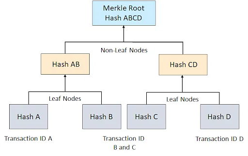

---
tags:
  - substrate
keywords: [polkadot, substrate, storage, storage items, tries]
description: Deep Dive into Substrate Storage - Part 1
updated: 2023-12-08
author: cenwadike
duration: 3h
level: intermediate
---

# Deep Dive into Substrate Storage - Part 1

Blockchains are sometimes referred to as glorified distributed database.
Although the statement is only partially true, blockchains fundamentally store
data. In addition to data storage blockchains usually keep a verifiable
tamper-proof record of the stored data using cryptographic guarantees under
certain defined rules. Most blockchains record data using key-value data
abstractions and store them as blocks which itself is kept in a key-value
database.

This is the first part of the series on Substrate storage. We will build a
comprehensive knowledge of how data is handled and stored within the context
of Substrate. This part of the series will cover abstractions and primitive
data structures supported by Substrate and will mention notable caveats and
relevant code implementations.

>Help us measure our progress and improve Substrate in Bits content by filling
out our living [feedback form](https://airtable.com/shr7CrrZ5zqlhWEUD).
It will only take 2 minutes of your time. Thank you!

## Overview of storage items

Substrate provides a couple of data structures called **storage items** which
abstract complex concepts away from the runtime engineer. These data structures
are versatile and adequately useful for most needs of a runtime engineer. These
data structures include the following:

- **`StorageValue`**: to store any single value, such as a u8.
- **`StorageMap`**: to store a single key to value mapping.
- **`StorageDoubleMap`**: to store values in a storage map with two keys.
- **`StorageNMao`**: to store values in a map with any arbitrary number of keys.

These data structures enable developers to build runtime logic around custom
data types. They ease working with runtime APIs and other Substrate FRAME
modules.
>To learn how you could build runtime logic around custom data types check out
>this [guide](./using-generic-type-in-custom-data.md).

Using **`StorageValue`** as the prototypical storage item, we will look at the
implementation details of Substrate storage items.

**`StorageValue`** storage items are useful for storing a single unit of data by
the runtime including **integer** types, **objects**, or a single collection of
related types.

**`StorageValue`** has two main implementations that can be found in the
Substrate repository. One of which is a **trait**, and the other an "**object**"
with its related function attributes. Both implementations are employed when
using this storage item. The **object** is used in the definition of a custom
data type, while the **trait** is used to manipulate data during a function
execution.

The **`StorageValue`** **trait** is defined like so:

```rust
pub trait StorageValue<T: FullCodec> {
  /// The type that get/take return.
  type Query;

  /// Get the storage key.
  fn hashed_key() -> [u8; 32];

  /// Does the value (explicitly) exist in storage?
  fn exists() -> bool;

  /// Load the value from the provided storage instance.
  fn get() -> Self::Query;

  /// Try to get the underlying value from the provided storage instance.
  ///
  /// Returns `Ok` if it exists, `Err` if not.
  fn try_get() -> Result<T, ()>;

  /// Store a value under this key into the provided storage instance.
  fn put<Arg: EncodeLike<T>>(val: Arg);

  // ----------- snip ------------------ 
}
```

> For full implementation, check
[here](https://paritytech.github.io/polkadot-sdk/master/src/frame_support/storage/mod.rs.html#64-196).

And the "**object**" is implemented like so:

```rust
pub struct StorageValue<Prefix, Value, QueryKind = OptionQuery, OnEmpty = GetDefault>(
  core::marker::PhantomData<(Prefix, Value, QueryKind, OnEmpty)>,
);

impl<Prefix, Value, QueryKind, OnEmpty> crate::storage::generator::StorageValue<Value>
  for StorageValue<Prefix, Value, QueryKind, OnEmpty>
where
  Prefix: StorageInstance,
  Value: FullCodec,
  QueryKind: QueryKindTrait<Value, OnEmpty>,
  OnEmpty: Get<QueryKind::Query> + 'static,
{
  type Query = QueryKind::Query;
  fn pallet_prefix() -> &'static [u8] {
    Prefix::pallet_prefix().as_bytes()
  }
  fn storage_prefix() -> &'static [u8] { // <-- TAKE NOTE
    Prefix::STORAGE_PREFIX.as_bytes()
  }

  // ----------- snip ------------------ 
}

impl<Prefix, Value, QueryKind, OnEmpty> StorageValue<Prefix, Value, QueryKind, OnEmpty>
where
  Prefix: StorageInstance,
  Value: FullCodec,
  QueryKind: QueryKindTrait<Value, OnEmpty>,
  OnEmpty: crate::traits::Get<QueryKind::Query> + 'static,
{
  /// Get the storage key.
  pub fn hashed_key() -> [u8; 32] {
    <Self as crate::storage::StorageValue<Value>>::hashed_key()
  }

  /// Does the value (explicitly) exist in storage?
  pub fn exists() -> bool {
    <Self as crate::storage::StorageValue<Value>>::exists()
  }

  /// Load the value from the provided storage instance.
  pub fn get() -> QueryKind::Query {
    <Self as crate::storage::StorageValue<Value>>::get()
  }

  /// Store a value under this key into the provided storage instance.
  pub fn set(val: QueryKind::Query) {
    <Self as crate::storage::StorageValue<Value>>::set(val)
  }

  // ----------- snip ------------------ 
}

```

>For full implementation, check
[here](https://paritytech.github.io/polkadot-sdk/master/src/frame_support/storage/types/value.rs.html#65-67).

> To learn how to optimize custom types for performance and security check out
previous guides [here](./Working%20efficiently%20with%20storage%20items.md) and
[here](./Blake2-vs-Twox64.md)

## Key-Value Storage Abstractions - Tries

All data guaranteed by a blockchain is fundamentally stored as a key-value
pair. Substrate uses **Patricia Merkle Tries** as storage abstraction over a
key-value database for efficient read and write. Substrate like other
blockchains package data as blocks, a process that is efficiently handled based
on attributes of a **Merkle Trie**

### What is a Trie (Tree)?

**Merkle Trie** is a [tree](https://en.wikipedia.org/wiki/Tree_(data_structure))
data structure in which every "leaf" (node) is labeled with the cryptographic
hash of a data and every non-leaf node is labeled with the cryptographic
hash of the labels of its child nodes. The *root* of a **Merkle Trie** is a
cryptographic proof of the entire **tree**. This allows efficient and secure
verification of the contents of a large data structure.


**Merkle Trie** provides inherent benefits within the context of Blockchain
development, including:

- Efficient data validation: *Transactions* `hashes` are composed to form the
**Trie** and passed among network participants as a *block* which can be easily
verified for tampering from a single *root* hash.

- Efficient data transport across the network: A *block* composed of
*transaction hashes* is more efficiently transported over a distributed network
than large files containing all transaction-related data.

- Optimized disk usage: It is much more efficient to validate a few hundred KB of data
in memory than several MB of data passed as a linear data type.

- Isolated data read and write: The design of Merkle enables even the most
related data to be updated without tampering with neighboring nodes using a
combination of the root of the trie, the height of the leaf in the trie, its
orientation (left or right), and its prefix.

### Retrieving data in a Trie (Tree)



From the diagram above, we can say that to access *Hash D*, we have to start
from the `Merkle Root` *Hash ABCD*, then through *Hash CD*, and then to
*Hash D*. We can re-write this like so: *Hash D* -> *Hash CD* -> *Hash ABCD*

Because a **Merkle Trie** is an abstraction over a key-value database, hashes
of a *leaf* are an associated key to data stored in the key-value database, and
by extension, a hash prefixes the data it represents.

This concept is important for preventing accidental squiggling over data
associated with a different account. A data prefix must be unique for each
storage item. By default, it is a hash derived from the pallet's unique ID and
the name of the object. In certain applications like in smart contracts, you
may need to specify an explicit prefix for a storage item to prevent
squiggling data related to a single contract account.

### Tries Paths and Data Storage

In the simplest description, a trie path is a path taken to reach a leaf in a
**Merkle Trie**. This path is taken to write data and read data for the first
time (the path is cached after the first read).

The trie path leads to the associated key (ie. node's hash) to a data. The
associated data further points to a key in the key-value database, which points
to the actual data in storage.

It is important to note that a trie path may span many levels of a tree and the
data retrieved may be stored across several associated keys for a comprehensive
data retrieval. an associated key itself may point to a key in the
key-value database further points to value which is a key to several other
values that hold the actual data.

>More on path optimization in the next part of this series.

### Balanced Trie and Child Trie

## Deep dive into tries - State Proofs and Transaction Data

We can consider *state proof* to be a summary that sufficiently describes a
chuck of data on the blockchain. In reality state proofs are cryptographic has
of transactions which have been vetted on by a blockchain consensus.

It can be simply visualized as the root hash derived from a trie of transactions.
The hashes of transactions as stated earlier are efficiently recorded as blocks.
As such a state can be defined like so:

```rust
StateProof = Hash(Block<Transaction>);
```

State proof are vital for bridge implementation, to verify a transaction and
carry out relevant actions on a remote chain. A remote chain can *prove* that a
transaction is part of a proof submitted like so:

```rust
fn get_transaction_from_transaction_id(encoded_proof: Proof, tx_hash: Hash) -> Transaction {
  // uses external in snow bridge to decode proof
  let decoded_proof = ext::decode_proof(encoded_proof);

  let transaction = decoded_proof
    .transactions
    .iter()
    .get(tx_hash);

  return transaction;
}
```

## Summary

In this guide, we laid the foundation of how data storage is abstracted in Substrate.

We developed an understanding of the following:

- How storage items are implemented in Substrate.
- Merkle Trie features.
- Accessing data through a Merkle Trie.

To learn more about Substrate storage items and Merkle trie, check out these
resources:

- [Storage Items](https://docs.substrate.io/build/runtime-storage/#transactional-storage)
- [Shawn T's Storage Deep Dive](https://www.shawntabrizi.com/assets/presentations/substrate-storage-deep-dive.pdf)

Keep an eye out for the second part of the series where we cover how data read
and write is optimized by Substrate, and how the external client manages the
key-value database.

>Help us measure our progress and improve Substrate in Bits content by filling
out our living [feedback form](https://airtable.com/shr7CrrZ5zqlhWEUD).
Thank you!
