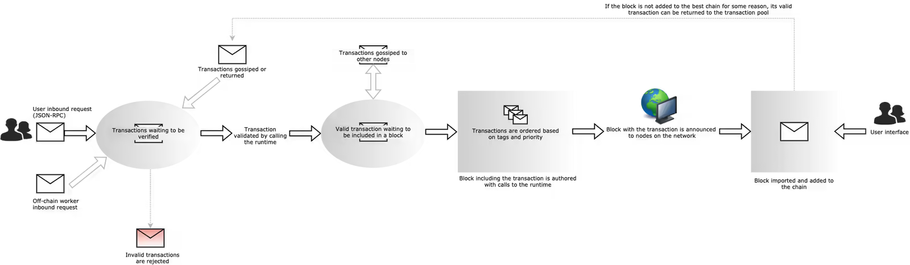

---
tags:
  - substrate
keywords: [polkadot, substrate, transaction, extrinsics, execution]
description: From Transaction to Block - Part 1
updated: 2023-09-22
author: cenwadike
duration: 3h
level: advanced
---

# From transaction to block

Transaction connotes different meanings under different settings, even in
software development. The concept of transactions in a traditional database
represents multiple and usually complex actions that potentially manipulate
data spanning different tables in a database. Transactions in blockchain 
have a similar connotation. Blockchain transaction describes a specific 
action and how a blockchain runtime should execute it.

Substrate and its ecosystem provide ergonomic tools and a modular approach that
can be used to construct transactions and implement all processes relevant to
transaction validation, transaction metering, transaction execution, and block 
propagation. Substrate also allows you as a developer to customize every step 
related to transaction execution and block production.

This guide is part 1 of a two-part series that provides a detailed description 
along with reference code implementation on how transactions and blocks are
handled in Substrate. In this guide, we break down the essential process
involving transactions within the context of Substrate and highlighting how each 
step can be customized.

>Help us measure our progress and improve Substrate in Bits content by filling
out our living [feedback form](https://airtable.com/shr7CrrZ5zqlhWEUD).
It will only take 2 minutes of your time. Thank you!

## Extrinsic vs Transaction

Transactions in Substrate are referred to as *Extrinsics*. This is because they
originate out of the runtime and are distinct from system calls originating
from the runtime and the core client. Extrinsics describes runtime calls and
usually contains a function signature, a signature created from the caller's 
private key, and some data to describe if the extrinsic has passed some validity 
checks. An extrinsic can be *conceptually* viewed like so:

```rust
type Extrinsic {
    pub_key: AccountId, 
    method: RuntimeCall, 
    param: Option<ParamType>
    signature: Option<Signature>, 
    data: SignedExtra,
}
```

In Substrate, the implementation of an extrinsic has two definitions, which are:
- **Extrinsic** `trait` vs **Extrinsic** `type alias`
  
- **Extrinsic** `trait` implements the "actions" an extrinsic should be able to
perform. These actions could be checking if a transaction is signed or any other
process that does not change the blockchain state and other runtime processes.

This also allows you as a runtime developer to customize what constitutes an
extrinsic for your Blockchain.

The Extrinsic trait is defined like so:

```rust
pub trait Extrinsic: Sized {
    type Call: TypeInfo;
    type SignaturePayload: SignaturePayload;

    // Provided methods
    fn is_signed(&self) -> Option<bool> { ... }
    fn new(
        _call: Self::Call,
        _signed_data: Option<Self::SignaturePayload>
    ) -> Option<Self> { ... }
}
```

- **Extrinsic** `type alias` is used to define an extrinsic within the *conceptual*
context of a Block.

The Extrinsic type alias is defined like so:

```rust
type Extrinsic: Member + Codec + Extrinsic + MaybeSerialize;
```

It is used to represent an extrinsics that constitutes a block.

> Note: More on Blocks in the section [here](##Executing-Extrinsics).

Substrate provides three (3) distinct formats of extrinsics based on the origin of 
the extrinsic. They include the following:

1. `Signed extrinsics`
2. `Unsigned extrinsics`
3. `Inherents`

### Signed extrinsics

Also called *Signed transactions* are the commonest form of a substrate extrinsic. 
They are generally used to make RPC requests to a chain and must contain the 
following:

- A signature from the account sending the inbound request to the runtime using
the sender's private key.
- sufficient *balance* in the sender's account to pay for the transaction fee.

A signed extrinsic can be *conceptually* viewed like so:

```rust
type Extrinsic {
    pub_key: AccountId, 
    method: RuntimeCall, 
    param: Option<ParamType>
    signature: Some(Signature), // <-- notice it must contain a signature
    data: SignedExtra,
}
```

### Unsigned extrinsics

Unsigned extrinsics do not include any information about who submitted the 
transaction. This form of extrinsic does not contain a field for signature and 
rather must meet conditions defined by the runtime to be valid.

Unsigned extrinsics are commonly used by off-chain workers to feed data to the
runtime and trigger function calls when certain conditions are met.

An unsigned extrinsic can be *conceptually* viewed like so:

```rust
type Extrinsic {
    pub_key: AccountId, 
    method: RuntimeCall, 
    param: Option<ParamType>
    signature: None, // <-- notice it does not contain a signature
    data: SignedExtra,
}
```

### Inherents

Substrate provides a special type of unsigned transaction that can be
constructed by block authors. They may contain the information required to
build a block such as timestamps, storage proofs, and information about 
preceding blocks, and can also include any other data the block author wishes 
to include.

Inherents are handled and represented differently within Substrate. And has a
different type from an **Extrinsic**.

Because Inherents have an endogenous origin and are only called just before a
block is created and proposed to other nodes in the network, it is defined
differently in Substrate.

Substrate inherent has a complex implementation and represents **InherentType**
like so:

```rust
type InherentType: Slot;

struct Slot(T);
```

This enables adaptable implementation for different block production mechanisms
like [BABE](https://www.polkadot.network/blog/polkadot-consensus-part-3-babe/).

Data created from an inherent is included first in a Block and the block's proposal.

You can learn more about Inherents [here](https://paritytech.github.io/polkadot-sdk/master/sp_consensus_babe/inherents/type.InherentType.html)

> Guide to Substrate Consensus is coming in a future article.

---

## Extrinsic Lifecycle



Moving along from the previous section, we may have a clue that extrinsics
contain information that the runtime could use to effect some changes to the
storage of the chain.

The changes are executed by the node that received the request, which is
usually a validating full node. The data changes are recorded and used
to construct a block proposal.

This section provides an overview of how extrinsics get processed by
a node and lays more groundwork for subsequent sections.

The process involved in an extrinsic life cycle is described
extensively in substrate [doc](https://docs.substrate.io/learn/transaction-lifecycle/#validating-and-queuing-transactions)

The process that will be discussed in this article includes the following:

- Extrinsic Submission
- Extrinsic Validation and Queuing
- Extrinsic Ordering
- Block Execution
- Block Initialization
- Block Propagation

## Submitting an extrinsic

This process usually occurs outside the entire chain’s client software and is
facilitated by external libraries. These external libraries are complex
packages however their core features include:

- generating signature from a private key
- creating a connection to a node
- constructing a valid extrinsic
- making a request containing the extrinsic

Most libraries within Substrate ecosystem also listen for runtime events and
confirm extrinsic execution, with excellent error handling.

Prominent Rust crates that enable developers to submit Extrinsic include:

- [Subxt](https://github.com/paritytech/subxt)
- [Substrate-api-client](https://github.com/scs/substrate-api-client)

A very popular alternative for Javascript developers is the PolkadotJs
[package](https://polkadot.js.org/docs/). [Substrate-api-sidecar](https://github.com/paritytech/substrate-api-sidecar)
is a Typescript-based package that interacts with Substrate nodes using RESTful
APIs.

Other options are available in other languages including Python, Kotlin, and
Java which can be found [here](https://github.com/substrate-developer-hub/awesome-substrate#client-libraries)

The Substrate transaction module is defined [here](https://paritytech.github.io/polkadot-sdk/master/sc_rpc_spec_v2/transaction/index.html).
It provides the Transaction [API](https://paritytech.github.io/polkadot-sdk/master/sc_rpc_spec_v2/transaction/transaction/struct.Transaction.html) which is leveraged by the packages mentioned above.

## Validating an Extrinsic

After a node receives an extrinsic, the node validates the extrinsic and adds
the extrinsic to its transaction pool.

An extrinsic is valid if it meets the criteria defined by the runtime. The
validity of an extrinsic is checked against certain criteria before it is
added to the node's transaction pool.

These criteria ensure the following:

- The extrinsic signature is cryptographically valid.
- The account of the caller has sufficient balance to cover runtime fees.
- The extrinsic nonce is valid.
- The extrinsic has not expired.
- The extrinsic has not been included in a previous block.
- The extrinsic data is not too large to be added to the current block.

> If data from an extrinsic is too large to be added, it is tagged as invalid
and moved to the next validation round for a future block where it may be added
before other extrinsic of similar priority or lower priority.

> The transaction nonce is mainly derived from the account of the caller and
denotes the index of the transactions originating from an account.

Transactions that do not meet all criteria defined in the runtime are dropped
from the transaction pool and do not get added to a Block proposal. These
invalid transactions do not get executed.

Substrate provides an interface that enables the core client to construct
extrinsic valid from the transaction pool.

The interface is defined like so:

```rust
pub trait TaggedTransactionQueue<Block: BlockT>: Core<Block> {
    // --------- snip -------- //

    fn validate_transaction(
        &self,
        __runtime_api_at_param__: <Block as BlockT>::Hash,
        source: TransactionSource,
        tx: <Block as BlockT>::Extrinsic,
        block_hash: Block::Hash
    ) -> Result<TransactionValidity, ApiError> { ... }
}
```

Substrate runtime also provides an interface that enables core client and
FRAME executive pallet to validate an extrinsic within a given block [here](https://paritytech.github.io/polkadot-sdk/master/src/sc_transaction_pool/graph/pool.rs.html#72-77) and [here](https://paritytech.github.io/polkadot-sdk/master/src/frame_executive/lib.rs.html#636-672)

A valid transaction is defined in Substrate like so:

```rust
pub struct ValidTransaction {
    pub priority: TransactionPriority,
    pub requires: Vec<TransactionTag>,
    pub provides: Vec<TransactionTag>,
    pub longevity: TransactionLongevity,
    pub propagate: bool,
}
```

Each field can be customized to meet the needs of your chain. For example, the
default **TransactionLongevity** is u64::MAX blocks. This means an otherwise 
valid transaction becomes invalid if it is not executed after 
*18446744073709551615* blocks from the block height at which it was submitted.

You can learn more about transaction validation [here](https://paritytech.github.io/polkadot-sdk/master/sp_runtime/transaction_validity/struct.ValidTransaction.html)

## Ordering Extrinsics

This step is carried out by a node if it is selected as the block author.

The authoring node in Substrate uses a priority system to order extrinsics
from the transaction pool. Recall that all transactions in the transaction pool
are valid at any point in time.

Transactions are ordered from the highest priority to the lowest priority until
the block reaches a maximum length or weight.

> Learn about weight in Substrate from our previous guide on benchmarking 
[here](./benchmarking-substrate-pallet).

It is important to note that this maximum length does not include `Inherents`.
Inherents have the highest priority in Substrate and can be included in a block
even after the maximum length is reached. And as always, you can override this 
behavior by customizing the `EnsureInherentsAreFirst` [trait](https://paritytech.github.io/polkadot-sdk/master/frame_support/traits/trait.EnsureInherentsAreFirst.html)

Substrate priority system ensures that transactions from an account are added
in ascending order of the transaction `nonce`. This ensures that transactions 
required by other transactions are added first, allowing a deterministic 
sequential execution of chained transactions.

Substrate uses "tags" to include higher-order transactions in a 
`ValidTransaction` as defined [here](#validating-an-extinsic)

## Executing Extrinsics

After valid transactions have been added to the transaction queue, the FRAME
executive [pallet](https://paritytech.github.io/polkadot-sdk/master/frame_executive/struct.Executive.html)
orchestrates the execution of all transactions. The "execution" of extrinsics 
is basically sequential calls to Substrate runtime that cause a change in some 
state value and generate a "proof". (More about this proof later).

The executive pallet instruments the execution of Extrinsics and is intricately
connected to the rest of the Substrate runtime. The executive's actions can be 
understood along the following phases:

- Initializing a block
- Executing transactions
- Finalizing a block

---

- **Initializing a block**

---

Here the executive pallet calls the `on_initialize` function in the FRAME system
pallet after which it calls the `on_initialize` function in other runtime
pallets (if any contain on_initialize) according to the order they are defined
in the **runtime/lib.rs** `construct_runtime!`. The `on_initialize` function
can be used to "hook" certain actions, that can be used to implement dynamic
business logic which should be completed before transactions are executed in the
runtime.

The executive pallet also checks the parent hash in the block header and the
trie root to verify that the digest from the hash is valid.

To learn about the implementation details of the `Header` passed, check [here](https://paritytech.github.io/polkadot-sdk/master/sp_runtime/generic/struct.Header.html).
To see the `Digest` implementation check [here](https://paritytech.github.io/polkadot-sdk/master/sp_runtime/generic/struct.Digest.html) and [here](https://paritytech.github.io/polkadot-sdk/master/sp_runtime/generic/enum.DigestItem.html#method.as_pre_runtime)

The executive pallet `initialize_block` function is defined like so:

```rust
/// Start the execution of a particular block.
pub fn initialize_block(header: &frame_system::pallet_prelude::HeaderFor<System>) {
    // ---------- snip ----------

    // verify header
    let digests = Self::extract_pre_digest(header);

    // initialize runtime pallets
    Self::initialize_block_impl(header.number(), header.parent_hash(), &digests);
}

fn initialize_block_impl(
  block_number: &BlockNumberFor<System>,
  parent_hash: &System::Hash,
  digest: &Digest,
 ) {
    let mut weight = Weight::zero();

    // ---------- snip ----------

    // call system `on_initialize` function
    <frame_system::Pallet<System>>::initialize(block_number, parent_hash, digest);

    // add weight for all on_initialize function execution
    weight = weight.saturating_add(<AllPalletsWithSystem as OnInitialize<
      BlockNumberFor<System>,
      >>::on_initialize(*block_number)
    );

    // ---------- snip ----------
}

```

---

- **Executing transactions**

---

After the block has been initialized, each transaction is executed in the 
order priority discussed in the preceding [section](#ordering-extrinsics).

It is important to know that state changes are written directly to storage
during execution. If a transaction were to fail mid-execution, any state
changes that took place before the failure would not be reverted, leaving the
block in an unrecoverable state.

When implementing custom transaction execution logic ensure the runtime performs
all necessary checks to ensure the extrinsic will succeed before committing any
state changes to storage.

It is also important to note that events are also written to storage. If a
transaction fails after an event is emitted, the event will not be reverted. As
such ensure that all your FRAME pallet logic should not emit an event before
performing the complementary actions.

The FRAME executive `execute_block` function is implemented like so:

```rust
pub fn execute_block(block: Block) {
    // -------- snip --------
  
    sp_tracing::within_span! {
        // initialize block
        Self::initialize_block(block.header());

        // any initial checks
        Self::initial_checks(&block);

        // execute extrinsics
        let (header, extrinsics) = block.deconstruct();
        Self::execute_extrinsics_with_book_keeping(extrinsics, *header.number());

        // any final checks, ensure hash is still valid
        Self::final_checks(&header);
    }
}
```

---

- **Finalizing a block**

---

> After all queued transactions have been executed, the executive pallet calls
into each pallet's on_idle and on_finalize functions (if any contain
on_initialize) to perform any final business logic that should take place at
the end of the block. The modules are again executed in the order that they are
defined in the construct_runtime! macro, but in this case, the on_finalize
function in the system pallet is executed last.

> After all of the on_finalize functions have been executed, the executive module
checks that the digest and storage root in the block header match what was
calculated when the block was initialized.

>The on_idle function also passes through the remaining weight of the block to allow for execution based on the usage of the blockchain.

The FRAME executive `finalize_block` function is implemented like so:

```rust
pub fn finalize_block() -> frame_system::pallet_prelude::HeaderFor<System> {
    // ----------- snip ----------

    sp_tracing::enter_span!(sp_tracing::Level::TRACE, "finalize_block");

    <frame_system::Pallet<System>>::note_finished_extrinsics();

    let block_number = <frame_system::Pallet<System>>::block_number();

    Self::idle_and_finalize_hook(block_number);

    <frame_system::Pallet<System>>::finalize()
}
```

Check out our guide [here](./working-with-hooks.md) on Substrate `Hook`s to
learn how you can use `on_initialize` and `on_finalize` Hooks to implement
interesting business logic on a runtime.

## Summary

This brings us to the end of part 1 of **from transaction to block**. In this
guide, we develop a fundamental understanding of what transactions are and 
how they are constructed within the context of Substrate.

We developed an understanding of the following:

- What an extrinsic is and its various forms
- How transactions are validated
- Substrate transaction priority system
- How transactions are queued
- How extrinsic get executed within the context of a block

We also got exposed to software libraries and implementation facilitating these
processes.

To learn more about how transactions and blocks are handled in Substrate,
check out these resources:

- [Extrinsic Wiki](https://url)
- [Key and Network Operation](https://docs.substrate.io/deploy/keys-and-network-operations/#:~:text=The%20Sr25519%20signature%20scheme%20is,signatures%20with%20Ristretto%20point%20compression.)
- [Extrinsic Tagging](https://paritytech.github.io/polkadot-sdk/master/sp_transaction_pool/runtime_api/trait.TaggedTransactionQueue.html#method.validate_transaction)
- [Extrinsic Validation](https://paritytech.github.io/polkadot-sdk/master/src/frame_executive/lib.rs.html#636-672)
- [Block and Extrinsic](https://paritytech.github.io/polkadot-sdk/master/src/sp_runtime/traits.rs.html#1259)
- [FRAME Executive Pallet](https://paritytech.github.io/polkadot-sdk/master/frame_executive/struct.Executive.html)

>Help us measure our progress and improve Substrate in Bits content by filling
out our living [feedback form](https://airtable.com/shr7CrrZ5zqlhWEUD).
Thank you!
